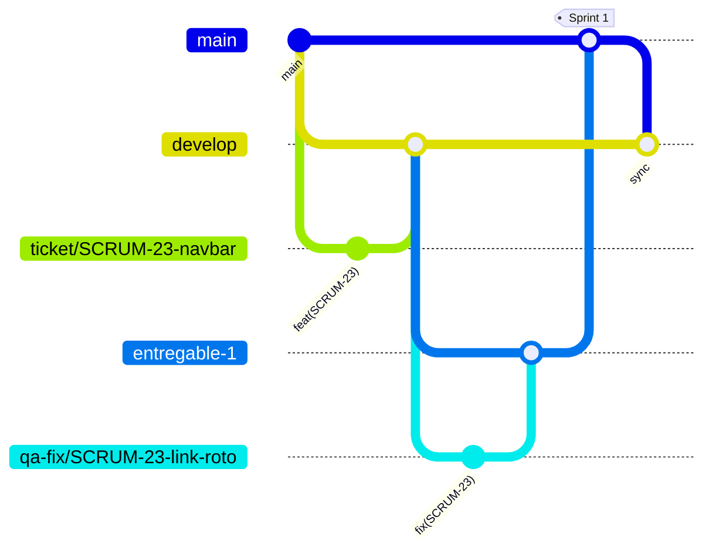

# Cómo contribuir — Tacha

## 1. Branching

Modelo exigido por el profesor para el proyecto del curso, en kebab-case y con la clave de Jira para trazabilidad. **Es obligatorio, sin excepciones.** El check `gitflow` del CI rechaza un PR con una combinación de ramas que no esté en esta tabla. Detalle para agentes de IA en [gitflow](.agents/skills/gitflow/SKILL.md).

| Rama | Nace de | Se fusiona a | Para qué |
|---|---|---|---|
| `main` | — | — | Lo ya entregado y aprobado por QA ("Master" en el diagrama del profesor) |
| `develop` | `main` | `entregable-{n}` | Integración continua de las historias terminadas del sprint. Rama default del repo |
| `ticket/SCRUM-{n}-descripcion` | `develop` | `develop` | Una historia o tarea de Jira |
| `entregable-{n}` | `develop` | `main` | Se congela **al cierre de cada sprint** (`entregable-1` = Sprint 1, `entregable-2` = Sprint 2...) y pasa por QA antes de llegar a `main` |
| `qa-fix/SCRUM-{n}-descripcion` | `entregable-{n}` | `entregable-{n}` | Corrige un hallazgo de QA sobre ese entregable |
| `hotfix/SCRUM-{n}-descripcion` | `main` | `main` | Corrección urgente sobre algo ya entregado |



### Ciclo de cada sprint

1. **Durante el sprint:** cada historia en su `ticket/SCRUM-{n}-...` desde `develop`, PR a `develop`. Solo se mergea con label `qa accepted`.
2. **Lunes de cierre** (revisión): se crea `entregable-{n}` desde `develop` con lo que se haya mergeado. Lo que no llegó a `develop` pasa al siguiente sprint; no se mete a la fuerza en el entregable.
3. **QA del entregable:** se prueba `entregable-{n}` completo. Cada hallazgo es un `qa-fix/SCRUM-{n}-...` desde `entregable-{n}`, con PR de vuelta a `entregable-{n}`. Nunca se commitea directo en `entregable-{n}`.
4. **Entrega:** con QA aprobado, PR de `entregable-{n}` a `main` (label `qa accepted`).
5. **Sincronizar:** inmediatamente después, PR de `main` a `develop` para que los `qa-fix` no se pierdan en el sprint siguiente. Lo mismo después de cada `hotfix`.

Nunca se trabaja ni se commitea directo sobre `main`, `develop` o `entregable-{n}`: todo entra por PR.

## 2. Commits

```
{type}(SCRUM-{n}): descripción corta en imperativo

[cuerpo opcional: el porqué, no el qué]
```

Tipos: `feat`, `fix`, `docs`, `refactor`, `test`, `chore`, `style`, `perf`.

## 3. Pull Requests

- Título con el mismo formato: `feat(SCRUM-14): descripción corta`. Los PRs de ciclo (`entregable-{n}` → `main`, `main` → `develop`) usan `chore(sprint-{n}): ...`.
- Se abre siempre, incluso trabajando solo: es el checkpoint de revisión antes de mergear.
- Nunca mergear una rama de trabajo en progreso sobre otra rama de trabajo en progreso.

### Labels de estado: exactamente uno, siempre

**Todo PR lleva exactamente un label de estado desde el momento en que se abre**, y se actualiza en cuanto cambia el estado. Un PR sin label, o con dos, lo marca en rojo el check `gitflow` del CI. Al abrirlo desde la terminal: `gh pr create --label "in progress"` (o `"waiting qa"` si ya está completo).

| Label | Significado | Lo pone | Columna en Jira |
|---|---|---|---|
| `in progress` | Se sigue trabajando, no listo para revisión | El autor, al abrir el PR | In Progress |
| `waiting qa` | Código completo, CI en verde, esperando que QA lo tome | El autor | Waiting QA |
| `qa accepted` | QA probó y aprobó: listo para merge | Quien hizo QA | QA Accepted |
| `qa denied` | QA encontró problemas: vuelve al autor | Quien hizo QA | QA Denied |
| `on hold` | Bloqueado por algo externo, o esperando que se mergee otra historia de la que depende | Cualquiera | On Hold |

Flujo: `in progress` → `waiting qa` → (`qa accepted` → merge) o (`qa denied` → vuelve a `in progress`). `on hold` puede aplicarse desde cualquier estado (se quita el anterior).

Reglas:
- **Solo se mergea con `qa accepted`.** Un PR con `waiting qa` no se mergea aunque esté aprobado en GitHub.
- Quien hace QA no es el autor del PR.
- Al cambiar el label, mover la tarjeta de Jira a la columna equivalente. Label y tarjeta siempre dicen lo mismo.
- **Una sola PR en `in progress` por persona.** Todas las demás PRs abiertas de esa persona tienen que estar en `on hold`, `waiting qa`, `qa accepted` o `qa denied`. Para retomar una PR que está en `on hold`, primero se pasa la actual a otro estado. El check `gitflow` del CI marca en rojo la PR que rompa esta regla.
- **Historia que depende de otra todavía no mergeada:** no se apila una rama sobre otra. La historia dependiente queda en `on hold` (label de su PR si ya existe, y su tarjeta de Jira en el estado On Hold) hasta que la otra reciba `qa accepted` y se mergee a `develop`; recién ahí su rama nace de `develop` actualizado. Mientras tanto se avanza en otra cosa.

### Plantilla de PR

Se autocompleta al abrir el PR (`.github/pull_request_template.md`). Completar siempre **Ticket** (clave del issue de Jira, ej. `SCRUM-14`), **Assignee** (quien hizo el trabajo) y **Reviewer** (a quién le toca revisar — rotar entre el equipo).

## 4. Tablero (Jira)

Columnas: `To Do → In Progress ⇄ On Hold → Waiting QA → (QA Denied → vuelve a In Progress) → QA Accepted → Done`. `On Hold` es un estado propio (se llega desde cualquier columna con la transición "On Hold" y se vuelve con la que corresponda al retomar). Cada historia enlaza al PR correspondiente vía el campo **Ticket** de la plantilla.

## 5. QA

Bug encontrado durante QA sobre un entregable → `qa-fix/SCRUM-{n}-...` desde ese `entregable-{n}` (ver sección 1, paso 3), no un parche silencioso sobre la rama original ya mergeada.

Formato de casos de prueba, reportes de bug y planes de prueba: [qa-testing-practices](.agents/skills/qa-testing-practices/SKILL.md).

## 6. Sprints

Sprints de una semana, de lunes a lunes; la revisión es el lunes en que cierra cada sprint, y ese día se crea `entregable-{n}` (sección 1). El primero arrancó el lunes 21 de septiembre, así que `entregable-1` se crea el lunes 28. Calendario y reparto de historias en [docs/sprints.md](docs/sprints.md) (Jira manda si no coinciden).

## 7. Definition of Done

Una historia pasa a `Done` solo si:

- [ ] El código sigue los skills de [AGENTS.md](AGENTS.md), incluida la estructura de carpetas (`app/` solo rutas)
- [ ] `npx tsc --noEmit`, `npm run lint` y `npm run build` pasan (el CI corre lint y build en cada PR)
- [ ] Tiene tests del camino feliz + al menos un caso negativo o límite ([qa-testing-practices](.agents/skills/qa-testing-practices/SKILL.md))
- [ ] Si toca auth, household, RLS, formularios o variables de entorno: se revisó con [security-practices](.agents/skills/security-practices/SKILL.md) (o el subagente `security-reviewer`)
- [ ] El PR usa la plantilla, con pasos de prueba manual, y otra persona del equipo lo aprobó
- [ ] QA lo probó sobre la rama y quedó en `qa accepted`
- [ ] Si cambió una decisión de producto o del modelo de datos, se actualizó `docs/documento-proyecto.md` en el mismo PR
